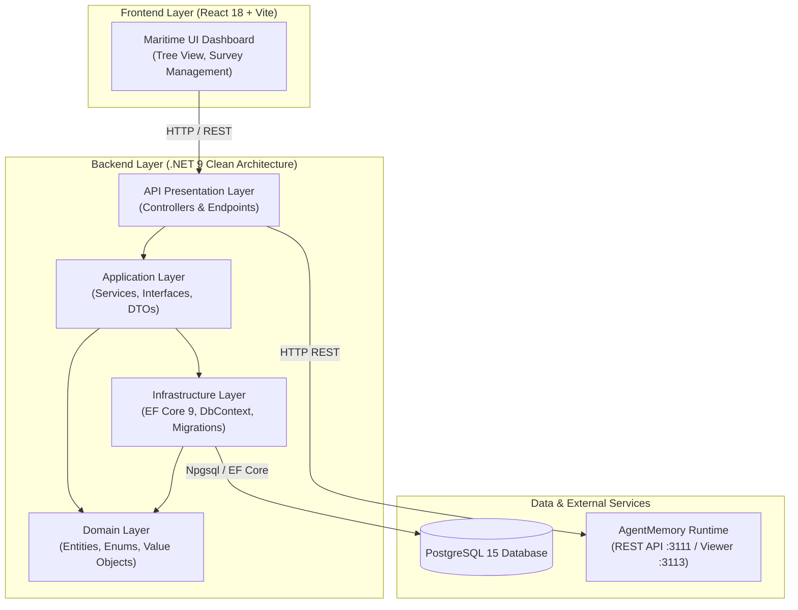

# ⚓ VMU Survey System (khaosatvmu)


**Hệ thống Đánh giá & Khảo sát Chất lượng Dạy - Học** dành riêng cho **Trường Đại học Hàng hải Việt Nam (VMU)**. Hệ thống được xây dựng trên kiến trúc Clean Architecture hiện đại, giao diện Maritime đậm chất hàng hải và tích hợp AI Agent Memory Runtime.

---

## 📋 Mục lục
- [⚓ Giới thiệu dự án](#-giới-thiệu-dự-án)
- [✨ Tính năng nổi bật](#-tính-năng-nổi-bật)
- [🛠️ Công nghệ sử dụng](#️-công-nghệ-sử-dụng)
- [🏛️ Kiến trúc hệ thống](#️-kiến-trúc-hệ-thống)
- [📂 Cấu trúc thư mục](#-cấu-trúc-thư-mục)
- [🚀 Hướng dẫn khởi chạy](#-hướng-dẫn-khởi-chạy)
  - [1. Khởi chạy bằng Docker Compose (Khuyên dùng)](#1-khởi-chạy-bằng-docker-compose-khuyên-dùng)
  - [2. Khởi chạy môi trường Local Development](#2-khởi-chạy-môi-trường-local-development)
  - [3. Tích hợp AI AgentMemory Runtime](#3-tích-hợp-ai-agentmemory-runtime)
- [⚙️ Biến môi trường (.env)](#️-biến-môi-trường-env)
- [📜 Quy chuẩn lập trình & Triết lý Ponytail](#-quy-chuẩn-lập-trình--triết-lý-ponytail)

---

## ⚓ Giới thiệu dự án

**VMU Survey System** là giải pháp toàn diện hỗ trợ Phòng Quản lý Chất lượng và các Khoa/Viện tại Trường Đại học Hàng hải Việt Nam triển khai, quản lý và thu thập dữ liệu khảo sát từ Sinh viên, Giảng viên và Cựu sinh viên.

Dự án tuân thủ nghiêm ngặt **Triết lý thiết kế Maritime**:
- **Bảng màu chủ đạo**: Hải quân hiện đại (`#0f172a` Navy Dark, `#1e293b` Slate, `#38bdf8` Cyan Accent).
- **Giao diện sắc nét**: Thiết kế vuông cạnh (sharp square corners, loại bỏ bo tròn `border-radius: 0px`) tạo sự chắc chắn, kỷ luật của ngành hàng hải.

---

## ✨ Tính năng nổi bật

1. **Quản lý cây đợt khảo sát (Survey Tree Architecture)**:
   - Phân cấp trực quan: `Năm học` ➔ `Học kỳ` ➔ `Đợt khảo sát`.
   - **Quick-Create Workflow**: Tạo nhanh đợt khảo sát trực tiếp ngay trên từng node danh mục.
2. **Kiến trúc Backend chuẩn Clean Architecture**:
   - Độc lập giữa Domain, Application, Infrastructure và API presentation layer.
   - Sử dụng Entity Framework Core 9 với PostgreSQL 15, hỗ trợ migrations & tự động seed dữ liệu mẫu.
3. **Giao diện Frontend React + TypeScript tối ưu**:
   - Trải nghiệm mượt mà, phản hồi tức thì với Vite bundler.
   - Hỗ trợ xem danh mục dạng cây, bộ lọc đợt khảo sát theo năm/học kỳ và biểu đồ thống kê.
4. **Tích hợp AgentMemory Runtime cho AI Agent**:
   - Bộ nhớ lưu trữ ngữ cảnh dài hạn cho AI Pair Programmer/Agents.
   - Hỗ trợ 54+ MCP (Model Context Protocol) tools và REST API.
   - Giao diện Visual Memory Viewer trực quan.

---

## 🛠️ Công nghệ sử dụng

| Phân vùng | Công nghệ / Thư viện | Mô tả |
| :--- | :--- | :--- |
| **Backend** | .NET 9 / C# | ASP.NET Core Web API (Clean Architecture) |
| **ORM & DB** | EF Core 9, PostgreSQL 15 | Quản trị dữ liệu quan hệ, Fluent API Configuration |
| **Frontend** | React 18, Vite, TypeScript | Giao diện Single Page Application (SPA) |
| **Styling** | Maritime Custom CSS | Hệ thống Style Navy sắc nét, vuông cạnh |
| **DevOps** | Docker, Docker Compose | Container hóa toàn bộ hệ thống |
| **AI Memory** | AgentMemory Engine (`iiidev/iii`) | Runtime lưu trữ tri thức & ngữ cảnh hệ thống cho AI |

---

## 🏛️ Kiến trúc hệ thống



---

## 📂 Cấu trúc thư mục

```text
khaosatvmu/
├── deploy/                   # Cấu hình triển khai & Docker (pgadmin, archives)
├── docs/                     # Tập trung hóa tài liệu dự án
│   ├── architecture/         # Quy chuẩn kiến trúc (AGENT_MEMORY, Ponytail)
│   ├── database/             # Thiết kế DB & sơ đồ quan hệ (dtb.md)
│   ├── plans/                # Kế hoạch triển khai & checklists
│   └── qa/                   # Tiêu chuẩn thiết kế UI & QA (design-qa.md)
├── rules/                    # Quy tắc hệ thống cho AI Assistant (.rulesforai)
├── scripts/                  # Script hỗ trợ (seed-memory.js, start-agentmemory)
├── src/
│   ├── Backend/              # Clean Architecture Backend (.NET 9)
│   │   ├── API/              # Presentation layer (.NET 9 Web API, Program.cs)
│   │   ├── Application/      # Interfaces, Services, DTOs
│   │   ├── Domain/           # Entities (AcademicYear, Semester, SurveyCampaign, ...)
│   │   ├── Infrastructure/   # EF Core 9 ApplicationDbContext, Seeders, Configurations
│   │   └── KhaosatVMU.sln    # Solution C# File
│   └── Frontend/             # React + Vite + TypeScript Frontend App
│       ├── public/           # Tài sản tĩnh
│       ├── src/              # React Components, Tree Views, Services, Types
│       ├── Dockerfile        # Container setup cho Frontend
│       ├── package.json      # Dependencies
│       └── vite.config.ts    # Cấu hình Vite
├── .dockerignore
├── .env.example              # File mẫu biến môi trường
├── docker-compose.yml        # Orchestration cho Postgres & pgAdmin
└── README.md
```

---

## 🚀 Hướng dẫn khởi chạy

### Yêu cầu hệ thống
- **Docker Desktop** (bản 20+ trở lên)
- **.NET 9.0 SDK** (cho phát triển local backend)
- **Node.js 18+** & **npm** (cho phát triển local frontend)

---

### 1. Khởi chạy bằng Docker Compose (Khuyên dùng)

1. **Tạo file cấu hình môi trường**:
   ```bash
   cp .env.example .env
   ```

2. **Khởi chạy các dịch vụ chính (Database, Backend, Frontend)**:
   ```bash
   docker compose up -d --build
   ```

3. **Truy cập ứng dụng**:
   - **Frontend UI**: [http://localhost:8080](http://localhost:8080)
   - **API health**: [http://localhost:8080/healthz](http://localhost:8080/healthz)
   - PostgreSQL chỉ bind vào loopback tại port `5432`; mật khẩu lấy từ `.env`.
   - pgAdmin chỉ chạy khi dùng `docker compose --profile tools up -d`.

---

### 2. Khởi chạy môi trường Local Development

#### **A. Chạy Backend (.NET 9 Web API)**
```bash
# Di chuyển vào thư mục dự án API
cd src/Backend/API

# Cấu hình local bằng .NET User Secrets, không commit credential
dotnet user-secrets set "ConnectionStrings:DefaultConnection" "Host=localhost;Port=5432;Database=khaosatvmu;Username=postgres;Password=<local-password>"
dotnet user-secrets set "Authentication:Google:ClientId" "<client-id>"
dotnet user-secrets set "Authentication:Google:ClientSecret" "<client-secret>"

# Chạy ứng dụng
dotnet run
```
*API Development lắng nghe tại `http://localhost:5115` theo `launchSettings.json`.*

#### **B. Chạy Frontend (React + Vite)**
```bash
# Di chuyển vào thư mục Frontend
cd src/Frontend

# Cài đặt thư viện
npm install

# Khởi chạy dev server
npm run dev
```
*Frontend sẽ chạy tại `http://localhost:5173`.*

---

### 3. Tích hợp AI AgentMemory Runtime

Hệ thống tích hợp **AgentMemory** để quản lý bộ nhớ dài hạn cho AI Agent trong quá trình phát triển.

1. **Bật AgentMemory container**:
   ```bash
   # Sử dụng script Windows
   .\scripts\start-agentmemory.cmd

   # Hoặc dùng Docker Compose Profile
   docker compose --profile agentmemory up -d
   ```

2. **Truy cập AgentMemory Services**:
   - **REST API Port**: `http://localhost:3111`
   - **Visual Memory Dashboard**: [http://localhost:3113](http://localhost:3113)

3. **Nạp dữ liệu tri thức ban đầu (Seed Memory)**:
   ```bash
   node scripts/seed-memory.js
   ```

---

## ⚙️ Cấu hình môi trường

File `.env` ở root chỉ phục vụ Docker Compose. Local API dùng .NET User Secrets hoặc environment variables. Production phải inject secret từ secret manager.

```env
# Database Settings
POSTGRES_USER=postgres
POSTGRES_PASSWORD=change-me
POSTGRES_DB=khaosatvmu
POSTGRES_PORT=5432

FRONTEND_BASE_URL=http://localhost:8080
ALLOWED_HOSTS=localhost
GOOGLE_CLIENT_ID=replace-me
GOOGLE_CLIENT_SECRET=replace-me
FRONTEND_PORT=8080
```

---

## 📜 Quy chuẩn lập trình & Triết lý Ponytail

Dự án áp dụng quy chuẩn lập trình **Ponytail AI Coding** (`docs/architecture/ponytail.md`):
- **Thang quyết định 7 bước (Decision Ladder)**: `Need (YAGNI)` ➔ `Codebase Reuse` ➔ `Stdlib` ➔ `Native Platform` ➔ `Installed Dependency` ➔ `One-Liner` ➔ `Minimal Implementation`.
- **Tối ưu hóa Codebase**: Giữ code gọn gàng, súc tích, tái sử dụng các abstraction có sẵn, hạn chế tối đa các dependency không cần thiết.

---

<p center align="center">
  <i>Được phát triển với định hướng chất lượng cao cho Trường Đại học Hàng hải Việt Nam ⚓</i>
</p>
