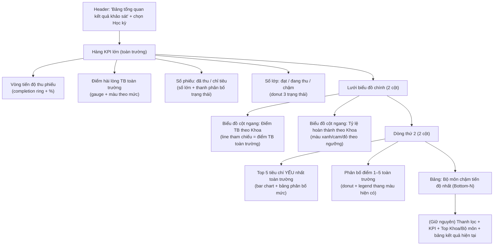

# Kế hoạch: Bảng tổng quan trực quan kết quả khảo sát toàn trường (Executive Survey Dashboard)

> **Hệ thống**: KhaosatVMU - Hệ thống Khảo sát ý kiến sinh viên Trường Đại học Hàng hải Việt Nam
> **Phạm vi**: Module "Thống kê & Báo cáo" (`ReportsOverviewPage`)
> **Mục tiêu**: Người quản lý **nhìn 1 lần** là nắm rõ ngay tình hình kết quả khảo sát của **cả trường** thông qua sơ đồ / biểu đồ / bảng biểu, thay vì phải đọc nhiều bảng rời rạc.

---

## 1. Bối cảnh & vấn đề hiện tại

### 1.1. Những gì hệ thống đang có

**Backend (Clean Architecture):**
- `Application/Reports/ReportContracts.cs` định nghĩa `IReportService` + các DTO.
- `Infrastructure/Reports/EfReportService.cs` triển khai 7 báo cáo:
  - `operational-progress` — tiến độ thu phiếu theo học kỳ (theo lớp).
  - `lecturers`, `lecturers/{id}` — đánh giá giảng viên (danh sách / chi tiết).
  - `faculties` — gộp so sánh cấp Khoa / Bộ môn (`FacultyDepartmentReportDto`).
  - `question-analysis` — phân tích từng câu hỏi theo **một** đợt khảo sát.
  - `section-analysis` — phân tích từng câu hỏi theo **một** lớp.
  - `results` — danh sách kết quả chi tiết từng lớp, có lọc Khoa/Bộ môn/GV/đợt/tìm kiếm.
- Mô hình dữ liệu: `Faculties` → `Departments` → `Lecturers` → `CourseSections` → `CourseSectionSurveys` → `SurveyResponses` (`Score` 0..5) → `SurveyResponseAnswers` (`SelectedValue` 1..5). Kèm `Semesters`, `AcademicYears`, `SemesterSurveys`, `SurveyTemplates`, `SurveyQuestions`.

**Frontend (React + TypeScript + recharts):**
- `ReportsOverviewPage.tsx` có: chọn học kỳ, thanh lọc (Khoa/Bộ môn/GV/đợt/tìm), 4 KPI (chỉ tiêu phiếu, đã thu, tỷ lệ hoàn thành, số lớp), 2 bảng xếp hạng **Top Khoa / Top Bộ môn theo điểm TB** (tính client-side từ `results`), bảng kết quả chi tiết có drill-down vào giảng viên và từng lớp.
- Đã có sẵn thư viện `recharts@3` và component `QuestionAnalysisChart` (bar chart theo câu hỏi).

### 1.2. Vấn đề cần giải quyết

| Vấn đề | Mô tả |
|---|---|
| Thiếu "bức tranh tổng thể" | Quản lý phải tự đọc bảng KPI + 2 bảng xếp hạng + bảng chi tiết rồi **tự gộp nhận định** — không có một màn hình tổng hợp trực quan. |
| Chưa có cái nhìn **toàn trường** | `question-analysis` và `section-analysis` chỉ phân tích theo 1 đợt / 1 lớp; `faculties` không kèm tiến độ thu phiếu; không có "Top câu hỏi yếu nhất toàn trường", "phân bố điểm toàn trường", "bộ môn chậm nhất". |
| Xếp hạng tính client-side | `buildRanking()` gộp từ `results` nên chỉ đúng theo bộ lọc hiện tại, không có điểm TB tham chiếu toàn trường (`school average`), dễ lệch khi dữ liệu lớn. |
| Hiệu năng | Khi số lớp ~1.000 lớp/kỳ (theo `docs/concurrency_optimization_1000_users.md`), gộp client-side sẽ nặng; nên gộp ngay trong SQL. |

---

## 2. Mục tiêu & câu hỏi người quản lý cần trả lời "trong 1 cái nhìn"

Thiết kế bảng tổng quan phải giúp quản lý trả lời ngay 6 câu hỏi:

1. **Toàn trường đã thu được bao nhiêu phiếu / đạt bao nhiêu % so với chỉ tiêu?**
2. **Chất lượng tổng thể (điểm TB thang 5) của trường đang ở mức nào?** (Xuất sắc / Tốt / Trung bình / Cần cải thiện)
3. **Khoa nào đang dẫn đầu / tụt lại** về chất lượng (điểm TB) và **tiến độ thu phiếu?**
4. **Bộ môn / lớp nào đang chậm tiến độ nhất** (cần nhắc thu)?
5. **Những tiêu chí (câu hỏi) nào toàn trường đang yếu nhất** — cần cải tiến giảng dạy?
6. **Phân bố điểm (mức 1–5) của sinh viên toàn trường ra sao?**

> Giai đoạn 2 (tuỳ chọn): **So sánh với học kỳ trước** — tình hình đang tốt lên hay xấu đi.

---

## 3. Giải pháp đề xuất — "Executive Survey Dashboard"

Bố trí 1 khối **tổng quan trực quan** đặt **ngay đầu trang Thống kê & Báo cáo** (trên thanh lọc/KPI hiện tại), hiển thị dữ liệu **toàn trường theo học kỳ đã chọn**. Các bảng lọc/KPI/chi tiết hiện tại giữ nguyên ở bên dưới.

### 3.1. Wireframe giao diện (màn hình 1440px+)



- Mọi ô / cột đều **click được** để lọc xuống bảng chi tiết bên dưới (VD: click Khoa X → bộ lọc Khoa = X).
- Thang màu **tái sử dụng** đúng quy ước đang có trong `QuestionAnalysisChart`:
  - Điểm: `≥4.5` xanh lá (Xuất sắc), `4.0–4.49` xanh dương (Tốt), `3.0–3.99` cam (Trung bình), `<3.0` đỏ (Cần cải thiện).
  - Tiến độ: `≥80%` xanh lá, `40–80%` xanh dương, `<40%` cam (giống `completionColor`).

### 3.2. Quyết định thiết kế chính

1. **Thêm endpoint gộp riêng** `/api/v1/reports/school-overview?semesterId=` trả về **1 DTO tổng hợp** — tính gộp ngay trong SQL (theo đúng nguyên tắc hiệu năng trong `docs/concurrency_optimization_1000_users.md`), tránh gộp client-side.
2. **Nhất quán nguồn số liệu**: dùng cùng định nghĩa `completionRate = responses / classSize`, cùng thang điểm như các báo cáo đang có để không lệch số.
3. **Phân tách component**: tạo `SchoolSurveyOverview` (container) + các chart con, độc lập với `ReportsOverviewPage` để dễ bảo trì / tái dùng.
4. **Cache nhẹ** cho endpoint tổng quan (dữ liệu gộp thay đổi chậm), TTL ngắn — chi tiết ở mục 5.3.

---

## 4. Thiết kế Backend

### 4.1. DTO mới — thêm vào `Application/Reports/ReportContracts.cs`

```csharp
/// <summary>Bảng tổng quan toàn trường (executive summary) của một học kỳ.</summary>
public sealed record SchoolSurveyOverviewDto(
    int SemesterId,
    string SemesterName,
    string AcademicYearName,

    // 1) Quy mô & tiến độ thu phiếu
    int TotalSections,            // tổng số lớp đã phát phiếu
    int TotalTargetResponses,     // tổng chỉ tiêu (sĩ số)
    int TotalResponses,           // tổng phiếu đã thu
    decimal CompletionRate,       // % hoàn thành toàn trường
    int CompletedSectionCount,    // số lớp ≥ 80%
    int InProgressSectionCount,   // số lớp 40–80%
    int LaggingSectionCount,      // số lớp < 40%

    // 2) Chất lượng kết quả
    decimal OverallAverageScore,                 // điểm TB toàn trường (thang 5)
    IReadOnlyList<ScoreBandDto> ScoreDistribution, // phân bố theo nhóm điểm

    // 3) So sánh theo Khoa (để vẽ bar chart + reference line)
    decimal SchoolAverageScore,                  // = OverallAverageScore, dùng làm chuẩn so sánh
    IReadOnlyList<FacultyOverviewDto> Faculties,

    // 4) Bộ môn (để lọc "chậm tiến độ nhất")
    IReadOnlyList<DepartmentOverviewDto> Departments,

    // 5) Tiêu chí yếu nhất toàn trường (gộp mọi phiếu trong kỳ)
    IReadOnlyList<QuestionRatingDto> WeakestQuestions);

/// <summary>Một nhóm điểm trong phân bố điểm toàn trường.</summary>
public sealed record ScoreBandDto(
    int Band,          // 1..5 (theo ngưỡng điểm TB của từng phiếu)
    string Label,      // "Xuất sắc", "Tốt", "Trung bình", "Cần cải thiện"
    int Count,         // số phiếu rơi vào nhóm
    decimal Percentage);

/// <summary>Dữ liệu 1 Khoa cho biểu đồ tổng quan.</summary>
public sealed record FacultyOverviewDto(
    int FacultyId,
    string FacultyName,
    int DepartmentCount,
    int SectionCount,
    int TargetResponses,
    int ResponseCount,
    decimal CompletionRate,
    decimal AverageScore);

/// <summary>Dữ liệu 1 Bộ môn cho bảng "chậm tiến độ".</summary>
public sealed record DepartmentOverviewDto(
    int DepartmentId,
    string DepartmentName,
    int FacultyId,
    string FacultyName,
    int SectionCount,
    int TargetResponses,
    int ResponseCount,
    decimal CompletionRate,
    decimal AverageScore);
```

> `ScoreBand` ánh xạ ngưỡng điểm TB của **từng phiếu** (`SurveyResponse.Score`) đúng quy ước thang màu đang dùng:
> `≥4.5` Xuất sắc · `4.0–4.49` Tốt · `3.0–3.99` Trung bình · `<3.0` Cần cải thiện.

### 4.2. Endpoint — thêm vào `API/Reports/ReportEndpoints.cs`

```csharp
group.MapGet("/school-overview", async (
    int semesterId,
    IReportService reportService,
    CancellationToken cancellationToken) =>
{
    var report = await reportService.GetSchoolSurveyOverviewAsync(semesterId, cancellationToken);
    return report is null ? Results.NotFound() : Results.Ok(report);
});
```

### 4.3. Interface — thêm vào `IReportService`

```csharp
/// <summary>Lấy bảng tổng quan toàn trường của một học kỳ (executive summary).</summary>
Task<SchoolSurveyOverviewDto?> GetSchoolSurveyOverviewAsync(
    int semesterId,
    CancellationToken cancellationToken = default);
```

### 4.4. Triển khai trong `Infrastructure/Reports/EfReportService.cs` — gộp trong SQL

Điểm mấu chốt là **gộp ngay trong DB** bằng `GroupBy`/`Sum`/`Average` (đúng pattern `GetSurveyResultsAsync` đang dùng), hạn chế tối đa roundtrip:

1. Lấy `Semester`, `AcademicYear`, danh sách `SemesterSurveyId` của kỳ.
2. Lấy `CourseSectionSurveys` của kỳ → `CourseSectionId` tập hợp.
3. Lấy `CourseSections` → join `Lecturers` → `Departments` / `Faculties` (để nhóm theo Khoa/Bộ môn).
4. `SurveyResponses` của kỳ: một `GroupBy(CourseSectionSurveyId)` để lấy `(Count, TotalScore)` — **1 query duy nhất**.
5. Tính gộp:
   - Toàn trường: tổng chỉ tiêu, tổng phiếu, `CompletionRate`, `OverallAverageScore`.
   - `ScoreDistribution`: từ `SurveyResponse.Score` gộp theo nhóm (băng 1..5).
   - `Faculties` / `Departments`: nhóm từ kết quả bước 3+4 trong RAM (số Khoa/Bộ môn nhỏ).
   - `WeakestQuestions`: `SurveyResponseAnswers` của kỳ gộp theo `QuestionId` → `Average(SelectedValue)` + đếm; nối `SurveyQuestions` lấy nội dung; **lấy Top-N thấp nhất** (mặc định 5) có số lượt trả lời đủ lớn (≥ ngưỡng, tránh nhiễu), sắp xếp theo `averageScore` tăng dần.
6. Trả về `SchoolSurveyOverviewDto`.

Lưu ý:
- Tái sử dụng logic đếm trạng thái lớp (`≥80%` / `40–80%` / `<40%`) giống `GetOperationalProgressReportAsync` để số liệu đồng nhất.
- Nếu kỳ không có dữ liệu → trả về DTO với số liệu `0` (không `null` để UI vẽ được khung rỗng), hoặc `null` như các endpoint khác — chọn `null` và để UI hiện trạng thái "Chưa có dữ liệu".

### 4.5. Cache hiệu năng (khuyến nghị)

- Đăng ký `IMemoryCache` (đã có sẵn trong ASP.NET Core) cho riêng endpoint tổng quan.
- Key: `school-overview:{semesterId}`.
- TTL ngắn **60–120 giây** (dữ liệu gộp thay đổi chậm, chỉ tăng khi có phiếu mới).
- **Không cần** invalidate phức tạp; TTL ngắn đủ đảm bảo số liệu gần thời gian thực mà vẫn chịu được tải đọc khi hàng trăm phiếu nộp cùng lúc (xem `concurrency_optimization_1000_users.md`).

---

## 5. Thiết kế Frontend

### 5.1. Cấu trúc file

```
src/
  components/
    reports/
      SchoolSurveyOverview.tsx        # Container: nạp dữ liệu + bố cục tổng quan
      CompletionGauge.tsx             # Vòng tiến độ thu phiếu (SVG/RadialBarChart)
      SatisfactionGauge.tsx           # Điểm TB toàn trường (gauge + màu theo mức)
      FacultyScoreChart.tsx           # Bar ngang: điểm TB theo Khoa (+ reference line)
      FacultyCompletionChart.tsx      # Bar ngang: tỷ lệ hoàn thành theo Khoa
      ScoreDistributionDonut.tsx      # Donut phân bố điểm 1–5
      WeakestQuestionsPanel.tsx       # Top tiêu chí yếu nhất (bar + bảng phân bố)
      LaggingDepartmentsTable.tsx     # Bảng bộ môn chậm tiến độ nhất
  services/reportApi.ts               # + schoolOverview(semesterId)
  types/index.ts                      # + SchoolSurveyOverview, FacultyOverview, ...
  styles/reports.css                  # + class cho các khối tổng quan
  pages/ReportsOverviewPage.tsx       # + render <SchoolSurveyOverview /> ở đầu trang
```

### 5.2. Luồng dữ liệu

1. `ReportsOverviewPage` đã có `selectedSemesterId` → render `<SchoolSurveyOverview semesterId={selectedSemesterId} onDrillDown={...} />` ở đầu khối tổng hợp (chỉ khi không ở chế độ drill-down giảng viên / bài khảo sát).
2. `SchoolSurveyOverview` gọi `reportApi.schoolOverview(semesterId)` khi `semesterId` thay đổi.
3. `onDrillDown` đẩy bộ lọc xuống `ReportsOverviewPage` (VD: chọn Khoa → `setFacultyId`, cuộn xuống bảng chi tiết) — tái dùng state lọc hiện có, không thêm logic phức tạp.

### 5.3. Chi tiết từng khối & biểu đồ (recharts đã có sẵn)

| Khối | Loại biểu đồ / UI | Dữ liệu | Hành động khi click |
|---|---|---|---|
| **Vòng tiến độ thu phiếu** | `RadialBarChart` hoặc SVG ring | `CompletionRate`, `TotalResponses/TotalTargetResponses` | — |
| **Điểm hài lòng TB** | Gauge + màu theo `scoreColor` | `OverallAverageScore` | — |
| **Số phiếu + trạng thái lớp** | 3 số lớn + `PieChart`/donut (Hoàn thành/Đang thu/Chậm) | 3 count | Click nhãn → lọc bảng chi tiết theo trạng thái |
| **Điểm TB theo Khoa** | `BarChart` layout="vertical" + `ReferenceLine` = `SchoolAverageScore` | `Faculties[]` | Click Khoa → set `facultyId` |
| **Tỷ lệ hoàn thành theo Khoa** | `BarChart` layout="vertical", màu theo `completionColor` | `Faculties[]` | Click Khoa → set `facultyId` |
| **Top tiêu chí yếu nhất** | `BarChart` (cột ngang) + bảng phân bố mức | `WeakestQuestions` | — |
| **Phân bố điểm 1–5** | `PieChart`/donut + legend thang màu | `ScoreDistribution` | — |
| **Bộ môn chậm nhất** | Bảng tái dùng class `campaign-table` | `Departments` lọc `CompletionRate < 40` sắp theo tăng dần | Click Bộ môn → set `departmentId` |

### 5.4. TypeScript types — thêm vào `types/index.ts`

```ts
export interface ScoreBand { band: number; label: string; count: number; percentage: number; }
export interface FacultyOverview {
  facultyId: number; facultyName: string; departmentCount: number;
  sectionCount: number; targetResponses: number; responseCount: number;
  completionRate: number; averageScore: number;
}
export interface DepartmentOverview {
  departmentId: number; departmentName: string; facultyId: number; facultyName: string;
  sectionCount: number; targetResponses: number; responseCount: number;
  completionRate: number; averageScore: number;
}
export interface SchoolSurveyOverview {
  semesterId: number; semesterName: string; academicYearName: string;
  totalSections: number; totalTargetResponses: number; totalResponses: number;
  completionRate: number; completedSectionCount: number;
  inProgressSectionCount: number; laggingSectionCount: number;
  overallAverageScore: number; scoreDistribution: ScoreBand[];
  schoolAverageScore: number; faculties: FacultyOverview[];
  departments: DepartmentOverview[]; weakestQuestions: QuestionRating[];
}
```

### 5.5. CSS

- Thêm block `reports-exec-summary` vào `styles/reports.css` (tái dùng biến màu `--reports-primary`, `--reports-border`, font hiện có).
- Bố cục `grid`: hàng KPI (4 ô) + lưới biểu đồ 2 cột (responsive: 1 cột trên mobile ≤ 900px) — khớp chuẩn QA `docs/qa/design-qa.md` (không overflow ngang trang, table cuộn trong vùng riêng).
- Chế độ rỗng: hiển thị khung "Chưa có dữ liệu cho học kỳ này" giống `operations-empty` hiện có.

---

## 6. Phân chia giai đoạn triển khai

| Giai đoạn | Nội dung | Tiêu chí chấp nhận |
|---|---|---|
| **P1 — Backend** | DTO + interface + `GetSchoolSurveyOverviewAsync` + endpoint `/school-overview` (+ cache). | Gọi API trả đúng 6 nhóm dữ liệu, số liệu khớp các endpoint hiện có (kỳ có dữ liệu thật); không `N+1`; dữ liệu kỳ trống trả `null`. |
| **P2 — Frontend UI** | Types + `reportApi.schoolOverview` + 4 khối KPI/gauge + 2 biểu đồ Khoa + donut phân bố điểm. | Hiển thị đúng trên 1440px & 390px; không overflow; thang màu nhất quán; click Khoa → lọc bảng chi tiết. |
| **P3 — Frontend nâng cao** | `WeakestQuestionsPanel` + `LaggingDepartmentsTable` + chế độ rỗng/loading/error. | Top-N đúng thứ tự; bảng chậm nhất đúng; đủ 3 trạng thái loading/error/empty. |
| **P4 — Hoàn thiện & QA** | Build/lint pass, review `design-qa.md`, kiểm thử dữ liệu thật từ `khaosatvmu_dump.sql`. | Build + lint pass; không lỗi console; số liệu khớp dump. |

**Tổng ước lượng**: ~3–4 ngày (P1: 1 ngày, P2: 1–1.5 ngày, P3: 1 ngày, P4: 0.5 ngày).

---

## 7. Rủi ro & lưu ý

- **Nhiều template/đợt trong cùng kỳ**: `WeakestQuestions` gộp theo `QuestionId` qua nhiều template → cần kiểm tra câu hỏi trùng `QuestionId` giữa template; dùng ngưỡng số lượt trả lời tối thiểu để tránh câu hỏi ít dữ liệu lọt vào "yếu nhất".
- **`AverageScore = 0` hợp lệ**: giống các báo cáo hiện có, khi chưa có phiếu điểm TB = 0 → biểu đồ cần xử lý "Chưa có điểm" (thể hiện `—`) thay vì hiểu là điểm 0 thật.
- **Không gộp client-side**: giữ gộp trong SQL để tránh tải khi 1.000 lớp/kỳ.
- **Hiệu năng chart khi nhiều Khoa**: bar chart cuộn ngang nếu > 12 Khoa (tái dùng pattern scroll của `QuestionAnalysisChart`).
- **Đồng bộ số liệu**: KHÔNG tự định nghĩa lại công thức; tái sử dụng hằng số ngưỡng (`80%`, `40%`, `4.5/4.0/3.0`) từ code hiện có.

---

## 8. Kế hoạch kiểm thử

1. **Đơn vị (Backend)** — `tests/UnitTests/Application/` thêm:
   - `SchoolOverviewCalculationTests`: đúng `CompletionRate`, `OverallAverageScore`, phân bố nhóm điểm, phân loại trạng thái lớp, Top-N câu hỏi yếu nhất.
2. **API** — kiểm tra bằng `API.http` / Swagger với học kỳ có dữ liệu + học kỳ trống.
3. **UI** — QA thủ công theo checklist `design-qa.md` (2 viewport, không overflow, không lỗi console), kiểm tra click-drill-down.
4. **Hồi quy** — chạy bộ test hiện có (`tests/UnitTests`) đảm bảo không vỡ `EfReportService` / contracts.

---

## 9. File sẽ thay đổi / thêm mới

**Backend**
- ✏️ `src/Backend/Application/Reports/ReportContracts.cs` — DTO + interface.
- ✏️ `src/Backend/Infrastructure/Reports/EfReportService.cs` — triển khai `GetSchoolSurveyOverviewAsync`.
- ✏️ `src/Backend/API/Reports/ReportEndpoints.cs` — endpoint `/school-overview`.
- 🆕 `tests/UnitTests/Application/SchoolOverviewCalculationTests.cs`.

**Frontend**
- ✏️ `src/Frontend/src/types/index.ts` — types tổng quan.
- ✏️ `src/Frontend/src/services/reportApi.ts` — `schoolOverview()`.
- ✏️ `src/Frontend/src/pages/ReportsOverviewPage.tsx` — gắn component đầu trang.
- ✏️ `src/Frontend/src/styles/reports.css` — style tổng quan.
- 🆕 `src/Frontend/src/components/reports/SchoolSurveyOverview.tsx`
- 🆕 `src/Frontend/src/components/reports/CompletionGauge.tsx`
- 🆕 `src/Frontend/src/components/reports/SatisfactionGauge.tsx`
- 🆕 `src/Frontend/src/components/reports/FacultyScoreChart.tsx`
- 🆕 `src/Frontend/src/components/reports/FacultyCompletionChart.tsx`
- 🆕 `src/Frontend/src/components/reports/ScoreDistributionDonut.tsx`
- 🆕 `src/Frontend/src/components/reports/WeakestQuestionsPanel.tsx`
- 🆕 `src/Frontend/src/components/reports/LaggingDepartmentsTable.tsx`
